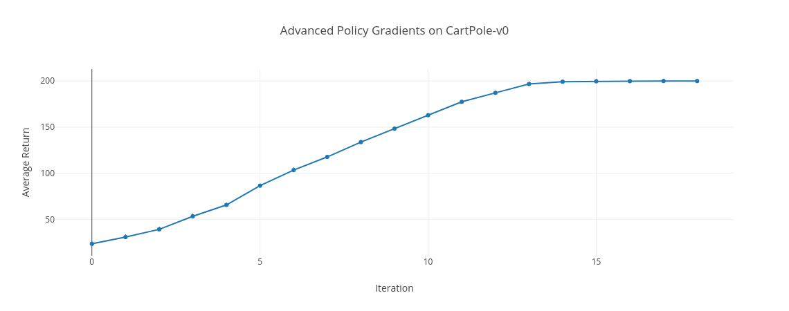
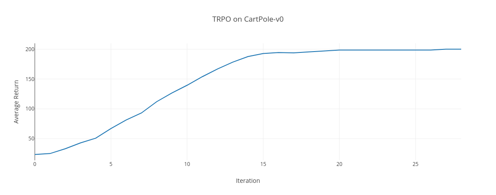
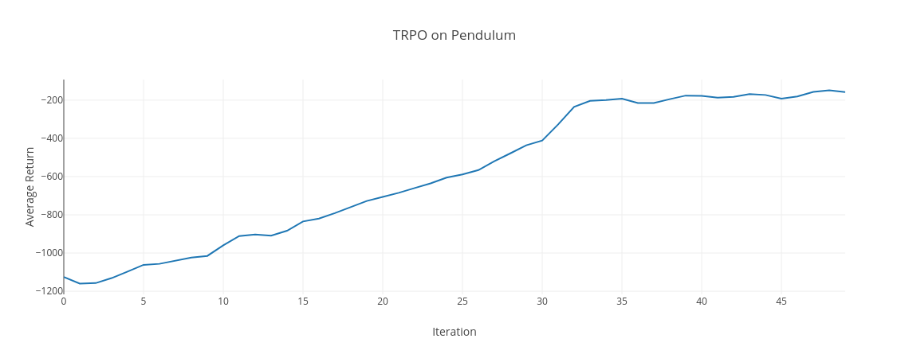
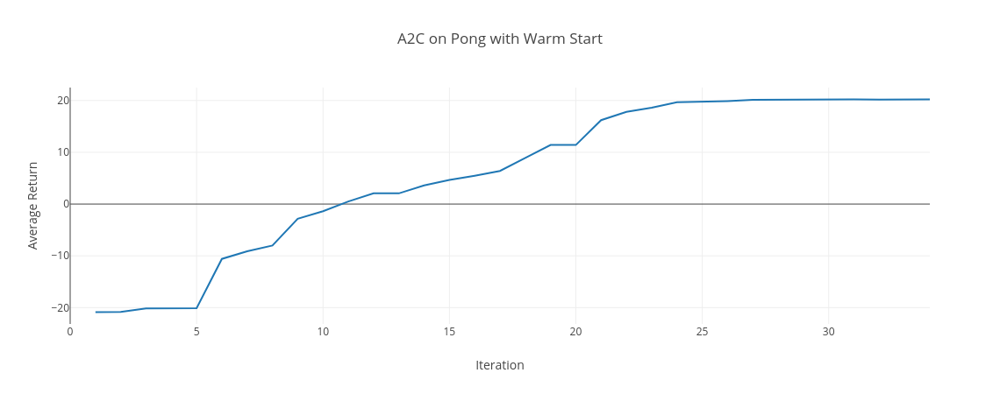
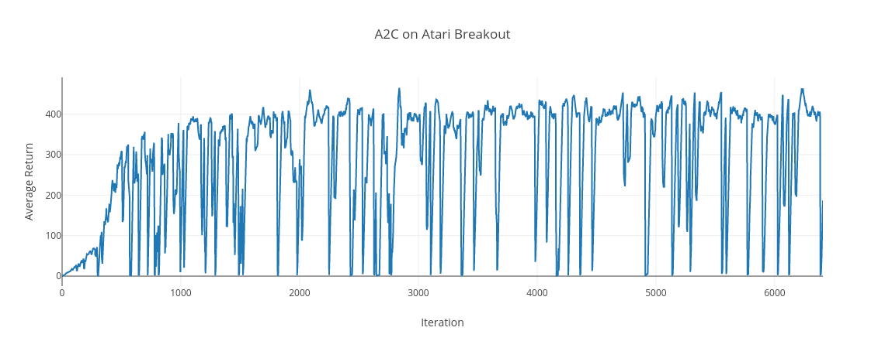

# Simple Policy Gradient Algorithm


## Continuous Actions on Point-v0

-25 Return after 100 Iterations without Time-Dependent Baseline:

```python simplepg/main.py Point-v0 --render True --use-baseline False```

-20 Return after 100 Iterations *with* Time-Dependent Baseline:

```python simplepg/main.py Point-v0 --render True```


## Discrete Actions on CartPole-v0

198 Average Return after 100 Iterations (default batch size 2000, discount 0.99, learning_rate 0.1):

```python simplepg/main.py CartPole-v0 --render True```

37.96 Average Return after 100 Iterations:

```python simplepg/main.py CartPole-v0 --batch_size 1000 --discount 0.95 --learning_rate 0.01```


# Natural Policy Gradients on CartPole-v0

200 Average Return after 72 Iterations:

```python simplepg/main.py CartPole-v0 --natural True```


# Advanced Policy Gradient on CartPole-v0

200 Average Return within 14 iterations:

```python run_pg_cartpole.py```

Visualize Final Policy:

```python sim_policy.py data/local/pg-cartpole```

Flask Web App with Charts:

```python viskit/frontend.py data/local/pg-cartpole```



# Trust Region Policy Optimization (TRPO) on CartPole-v0

200 Average Return within 20 iterations:

```python run_trpo_cartpole.py```

Visualize Final Policy:

```python sim_policy.py data/local/trpo-cartpole```

Flask Web App with Charts:

```python viskit/frontend.py data/local/trpo-cartpole```



# TRPO on Pendulum

-200 Average Return within 34 iterations

```python run_trpo_pendulum.py```

Visualize Final Policy

```python sim_policy.py data/local/trpo-pendulum```

Flask Web App with Charts

```python viskit/frontend.py data/local/trpo-pendulum```



# A2C with warm start on Pong

X Average Return within X iterations

```python run_a2c_pong_warm_start.py```

Visualize Final Policy

```python sim_policy.py data/local/a2c-pong-warm-start```

Flask Web App with Charts

```python viskit/frontend.py data/local/a2c-pong-warm-start```




# A2C on Breakout

480 Average Return within 6800 iterations

```python run_a2c_breakout.py```

Visualize Final Policy

```python sim_policy.py data/local/a2c-breakout```

[MP4 of Game with 848 Return](assets/a2c-breakout_848.mp4)

Flask Web App with Charts

```python viskit/frontend.py data/local/a2c-breakout```




# Installation

```
pip install scipy tblib cloudpickle tqdm opencv-python flask plotly
pip install gym[atari]
```